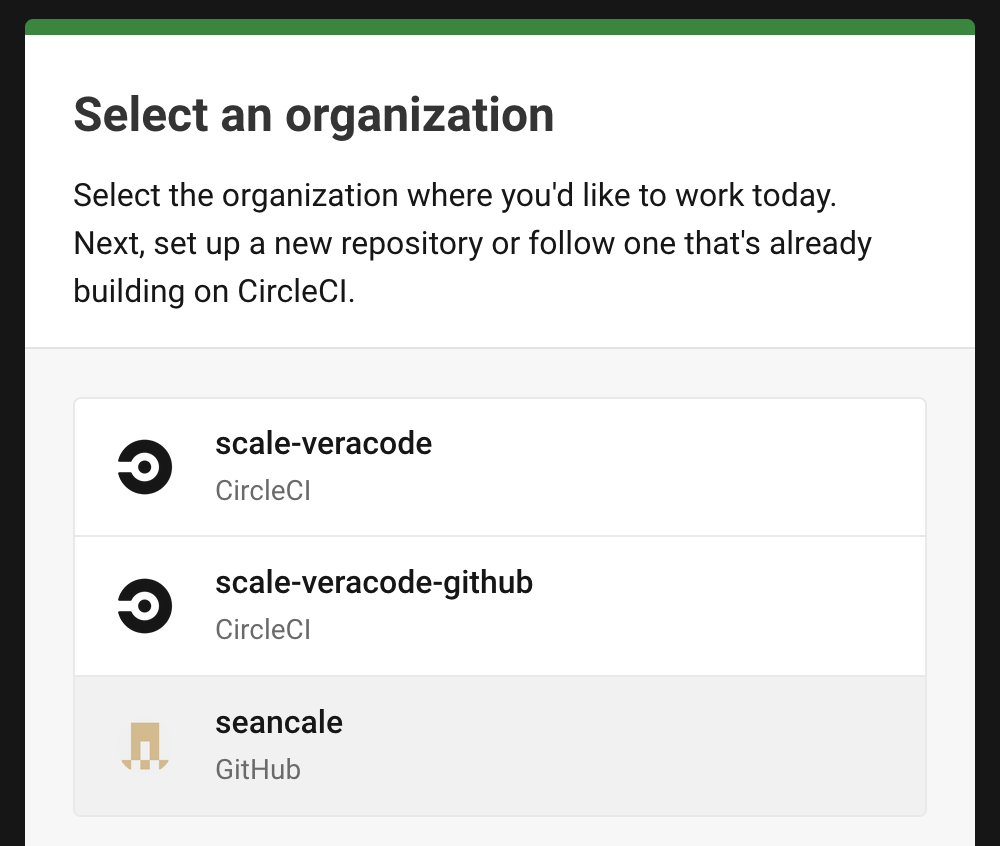
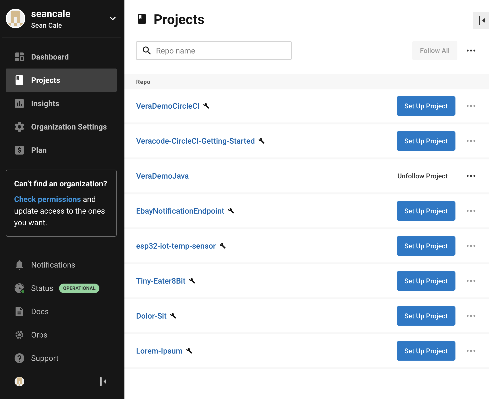
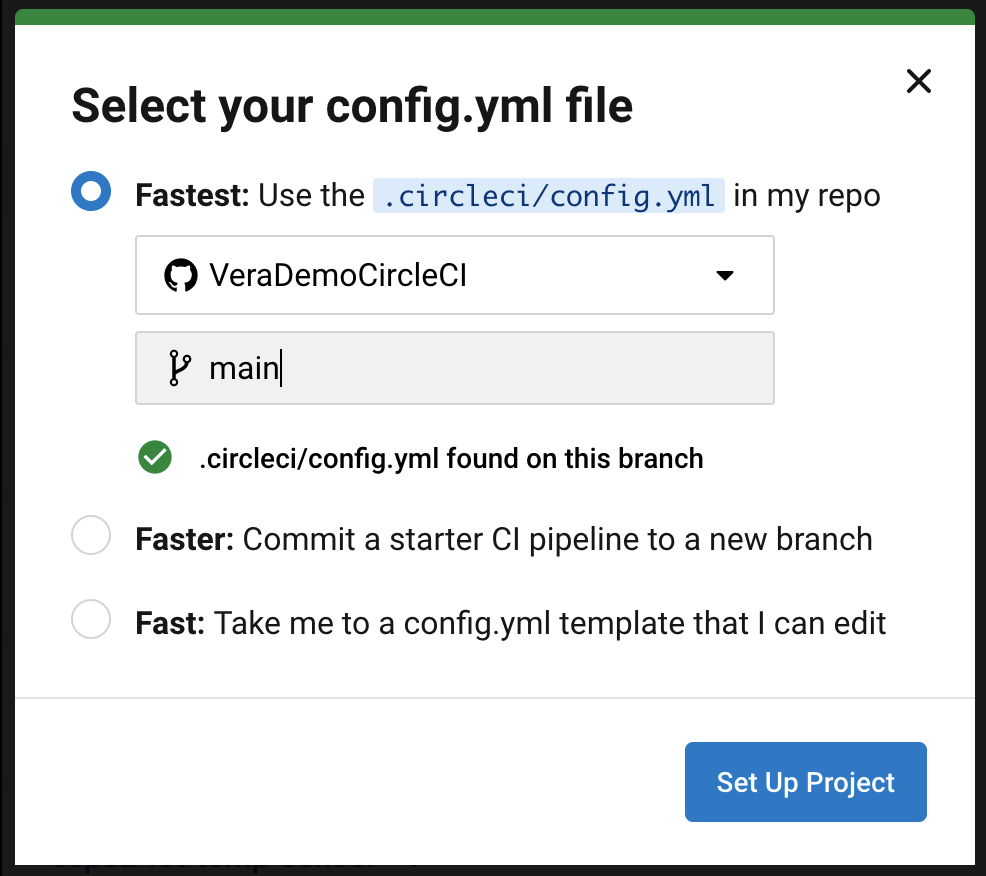
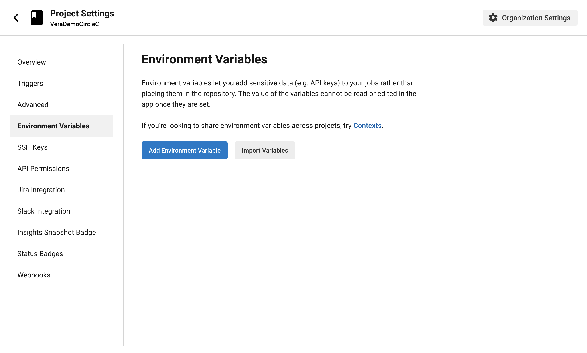
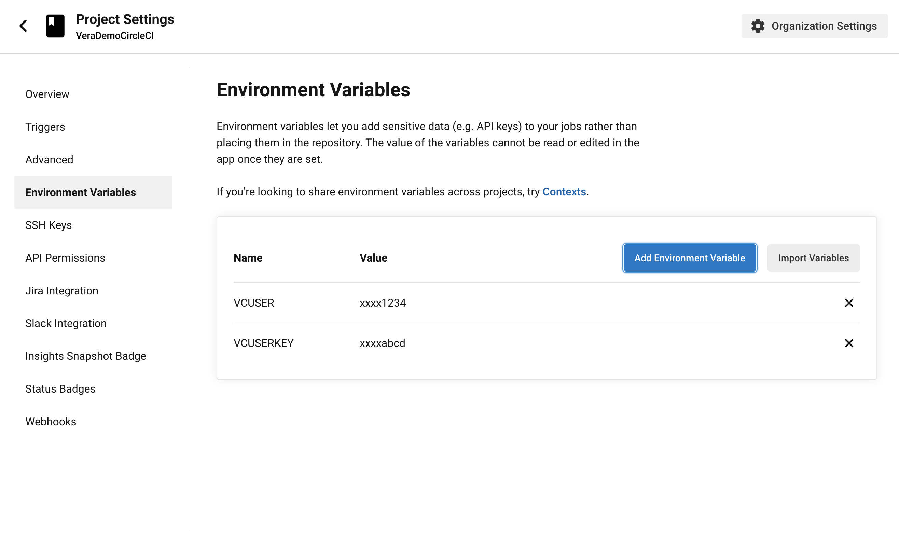

# Veracode-CircleCI-Getting-Started

This guide will show you how to submit a Veracode static analysis scan from a CircleCI pipeline.

---

# Prerequisites

* A GitHub account linked to your CircleCI account. [For instructions on how to link the accounts, see the CircleCI documentation.](https://circleci.com/docs/github-integration)
* Veracode API keys. [To obtain Veracode API keys, see the Veracode documentation.](https://docs.veracode.com/r/t_create_api_creds)

---

# Configuration Steps

* Import the VeraDemoJava repository
* Create and set up a project in CircleCI
* Run the example pipeline

## Importing the Repository

Click on Import Repository under the add menu on the top right of the screen

For the repository URL, paste in `https://github.com/seancale/VeraDemoJava`

The name of your repository doesn't matter and can be public or private.

Click on Begin Import. It will take a moment for the repository to be imported. Once it's done, click the link to your new repository.

 
---

## Creating and Setting Up a CircleCI Project

Head over to the [CircleCI Dashboard](https://app.circleci.com/dashboard) and log in. If you see a prompt (pictured below) that asks which organization you'd like to sign in to, choose the one with your GitHub profile picture and name. In this example, the GitHub account is the bottom row.

You should be brought to the projects screen, which has a list of all repositories in your GitHub account.

Locate the repository that was imported in the previous step. In this example, it is the `VeraDemoCircleCI` repository, which is the first item in the list. Click on the `Set Up Project` button. A prompt will show up asking you where the pipeline configuration file is located. The example configuration is located in the `main` branch.

Click the `Set Up Project` button. You will be taken to the pipelines screen where you should see that the example pipeline has started running. It will fail because the Veracode API keys have not been configured yet. Go to `Project Settings` (located near the top right on the pipelines screen) and then click `Environment Variables` on the left.

Create two environment variables, one named `VCUSER` and the other named `VCUSERKEY` (names are case sensitive). `VCUSER` is for your API key ID, and `VCUSERKEY` is for your API key secret.

Now, head back to the pipelines screen. Next, run the sample pipeline.

## Running the Sample Pipeline

