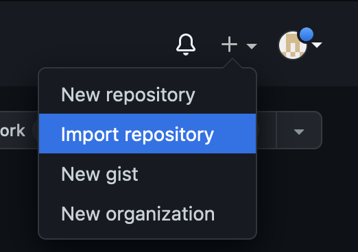
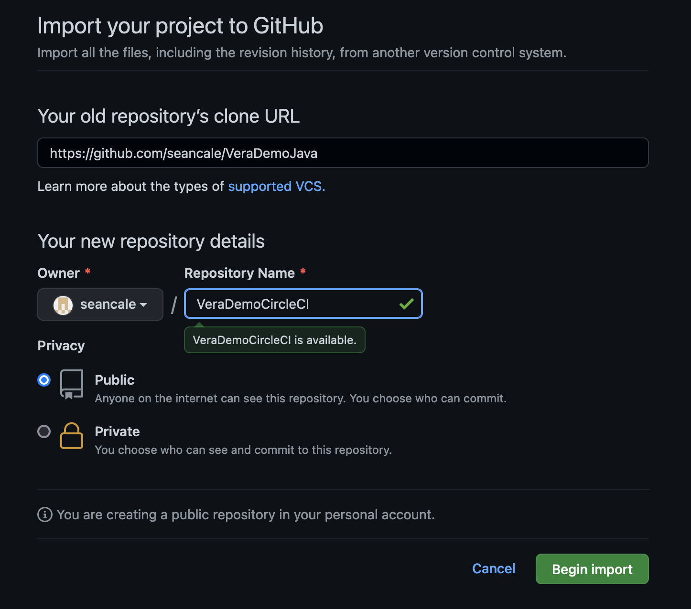
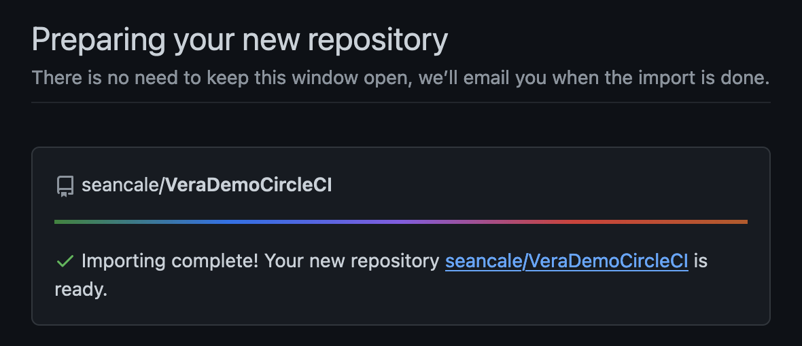

# Veracode-CircleCI-Getting-Started

This guide will show you how to submit a Veracode static analysis scan from a CircleCI pipeline.

---

# Prerequisites

You need to have a GitHub account linked to your CircleCI account. [For instructions on how to link the accounts, see the CircleCI documentation.](https://circleci.com/docs/github-integration)

---

# Configuration Steps

* Import the VeraDemoJava repository
* Create a project in CircleCI
* Run the example pipeline

## Importing the Repository

Click on Import Repository under the add menu on the top right of the screen

For the repository URL, paste in `https://github.com/seancale/VeraDemoJava`

The name of your repository doesn't matter and can be public or private.

Click on Begin Import. It will take a moment for the repository to be imported. Once it's done, click the link to your new repository.

